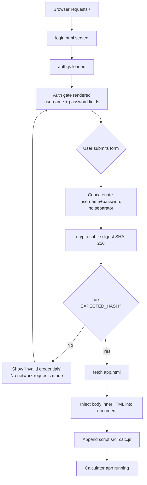

# Design Document: Login Authorization

## Overview

This feature adds a client-side authentication gate to the BTC Trading Calculator. The entry point becomes a lightweight `login.html` that renders only the auth form. The existing `index.html` (the calculator app) is renamed to `app.html`. On successful SHA-256 credential verification, `auth.js` dynamically fetches `app.html`, injects its body content into the DOM, and appends a `<script>` tag for `calc.js`. Before authentication, no calculator HTML, no `calc.js` reference, and no `app.html` fetch appear in the browser.

The entire implementation is plain HTML/CSS/JS — no frameworks, no build tools, no npm. Hashing uses the browser-native `crypto.subtle.digest` API. The auth gate reuses the same CSS custom properties and visual language as the main app.

---

## Architecture



### File Structure Changes

```
/
├── login.html      # NEW — entry point, auth gate only, loads auth.js
├── auth.js         # NEW — SHA-256 verification + dynamic app loading
├── app.html        # RENAMED from index.html — calculator app, never served directly on load
├── style.css       # EXTENDED — auth gate styles appended
├── calc.js         # UNCHANGED
└── .kiro/
    └── specs/login-authorization/
```

The server (CloudFront) must be reconfigured to serve `login.html` as the default root document instead of `index.html`.

---

## Components and Interfaces

### login.html

Minimal HTML document. Contains only:
- `<link>` to `style.css`
- The auth gate markup: logo, form (username input, password input, login button, error span)
- `<script src="auth.js">` at end of body

No calculator markup. No reference to `calc.js` or `app.html`.

### auth.js

Single script, `'use strict'`, no modules. Exports no globals except what is needed for inline event handlers.

Key responsibilities:
1. On `DOMContentLoaded`, focus the username input.
2. Attach `keydown` Enter listener to both input fields.
3. On form submit: validate non-empty fields, compute SHA-256, compare to `EXPECTED_HASH`.
4. On success: call `loadApp()`.
5. On failure: show error message; hide it again on next input event.

```
hashCredentials(username, password) → Promise<string>
  - Concatenates username + password (no separator)
  - Encodes as UTF-8 via TextEncoder
  - Calls crypto.subtle.digest('SHA-256', buffer)
  - Returns lowercase hex string (64 chars)

handleSubmit(event) → void
  - Reads username/password values
  - Guards against empty fields (shows error, returns early)
  - Calls hashCredentials, then compares to EXPECTED_HASH
  - Calls loadApp() or showError()

loadApp() → void
  - fetch('app.html')
  - Parse response text as HTML via DOMParser
  - Extract body innerHTML
  - Replace document.body innerHTML with app content
  - Append <script src="calc.js"> to document.body

showError() → void
  - Sets error element textContent to 'Invalid credentials'
  - Makes error element visible

hideError() → void
  - Hides error element
```

### app.html

The current `index.html` renamed. No structural changes to its content. The `<script src="calc.js">` tag at the bottom of its body is removed — `auth.js` appends it dynamically after injection. This prevents `calc.js` from being parsed before auth.

### style.css additions

A new section `/* ─── Auth gate ───... */` appended after the existing rules. Uses only existing CSS custom properties from `:root`. No new custom properties needed.

Auth-specific classes:
- `.auth-wrap` — full-viewport flex centering container
- `.auth-card` — centered card, same `--bg-card` / `--border` / `--radius-lg` as `.card`
- `.auth-logo` — reuses `.logo` layout
- `.auth-error` — error text, `color: var(--loss)`, hidden by default via `display: none`
- `.btn--auth` — extends `.btn`, uses `--neutral` for border/text color

---

## Data Models

### Credential verification (stateless, in-memory only)

```
EXPECTED_HASH: string  // 64-char lowercase hex, hard-coded in auth.js
                       // = SHA-256("username" + "password") with no separator

AuthState (ephemeral, never persisted):
  username: string     // read from DOM input at submit time
  password: string     // read from DOM input at submit time
  credentialString: string  // username + password concatenated
  computedHash: string      // 64-char hex result of SHA-256(credentialString)
```

No `localStorage`, no `sessionStorage`, no cookies. Auth state exists only in the call stack during `handleSubmit`. On page reload, the user must re-authenticate.

### App loading (one-shot)

```
AppLoadState:
  fetched: boolean     // true after fetch('app.html') resolves
  injected: boolean    // true after body innerHTML replaced
  scriptAppended: boolean  // true after calc.js script tag appended
```

This is implicit in the sequential `async/await` flow of `loadApp()`, not a stored object.

---

## Correctness Properties

*A property is a characteristic or behavior that should hold true across all valid executions of a system — essentially, a formal statement about what the system should do. Properties serve as the bridge between human-readable specifications and machine-verifiable correctness guarantees.*

### Property 1: Initial DOM contains no app content

*For any* load of `login.html`, the initial document body must contain no element with a class or id belonging to the calculator app (`.card`, `.panel`, `#panel-long`, `#panel-short`, `.tab`, `.modal-overlay`, etc.) and must contain no `<script>` reference to `calc.js` or `app.html`.

**Validates: Requirements 1.2, 5.1, 5.3**

---

### Property 2: SHA-256 hex output is always 64 lowercase hex characters

*For any* non-empty credential string, `hashCredentials` must return a string of exactly 64 characters where every character is in `[0-9a-f]`.

**Validates: Requirements 2.3**

---

### Property 3: Credential string is strict concatenation with no separator

*For any* username string `u` and password string `p`, the credential string passed to SHA-256 must equal `u + p` (i.e. `u.length + p.length === credentialString.length` and no extra characters are inserted).

**Validates: Requirements 2.1**

---

### Property 4: SHA-256 produces correct known-answer output

*For any* input string with a known SHA-256 digest (e.g. the empty string hashes to `e3b0c44298fc1c149afbf4c8996fb92427ae41e4649b934ca495991b7852b855`), `hashCredentials` must return that exact digest.

**Validates: Requirements 2.2**

---

### Property 5: Wrong credentials never trigger app loading

*For any* username/password pair whose SHA-256 does not equal `EXPECTED_HASH`, calling `handleSubmit` must not cause any fetch of `app.html` or `calc.js`, and must not inject any calculator DOM elements into the document.

**Validates: Requirements 4.3, 5.2**

---

### Property 6: Empty field submissions are rejected without hashing

*For any* form submission where the username field, the password field, or both are empty strings, the system must display "Invalid credentials" and must not invoke `crypto.subtle.digest`.

**Validates: Requirements 7.2**

---

## Error Handling

| Scenario | Behavior |
|---|---|
| Wrong credentials | Show "Invalid credentials" inline; retain inputs; no app load |
| Empty username or password | Show "Invalid credentials" immediately; skip SHA-256 |
| `fetch('app.html')` network failure | Show "Invalid credentials" (or a generic load error); do not leave a broken DOM |
| `crypto.subtle` unavailable (non-HTTPS) | `crypto.subtle` is `undefined` on non-secure origins; `auth.js` should guard with a try/catch and show an error message |
| User modifies input after error | Hide error message on `input` event of either field |

The `loadApp` function wraps the fetch in a `try/catch`. On failure it restores the auth gate and shows an error rather than leaving a blank page.

---

## Testing Strategy

### Dual approach

Both unit tests and property-based tests are required. They are complementary:
- Unit tests cover specific examples, integration points, and edge cases.
- Property tests verify universal invariants across many generated inputs.

### Property-based testing library

**fast-check** loaded via CDN `<script>` tag (no npm):

```html
<script src="https://cdn.jsdelivr.net/npm/fast-check@3/lib/bundle/fast-check.min.js"></script>
```

Each property test runs a minimum of **100 iterations**.

Tag format for each test:
`// Feature: login-authorization, Property N: <property text>`

### Property tests (one test per property)

| Property | Test description |
|---|---|
| P1: Initial DOM has no app content | Parse `login.html` as a string; assert no `.card`, `#panel-long`, `calc.js` references appear |
| P2: Hash output is always 64 lowercase hex chars | `fc.string()` → call `hashCredentials` → assert length === 64 and `/^[0-9a-f]+$/` |
| P3: Credential string is strict concatenation | `fc.string() × fc.string()` → assert `credentialString === u + p` |
| P4: Known-answer SHA-256 correctness | Fixed known inputs → assert exact expected digest |
| P5: Wrong credentials never load app | `fc.string() × fc.string()` (filtered to exclude correct creds) → assert no fetch called, no app DOM injected |
| P6: Empty fields rejected without hashing | `fc.oneof(fc.constant(''), fc.string())` for each field with at least one empty → assert `crypto.subtle.digest` not called |

### Unit tests (specific examples and edge cases)

- Correct credentials → auth gate removed, app content injected, `calc.js` script appended
- Failed auth → error message visible, inputs retained
- Error hidden on input event after failure
- Enter key on username field triggers submit
- Enter key on password field triggers submit
- Username field has focus on page load
- Logo element present in auth gate DOM
- `fetch` failure during `loadApp` → error shown, page not broken
- `crypto.subtle` unavailable → graceful error message shown

### Test file

Tests live in `tests.js` (existing file), consistent with the project's single-file test convention. The fast-check CDN script tag is added to the test runner HTML.
