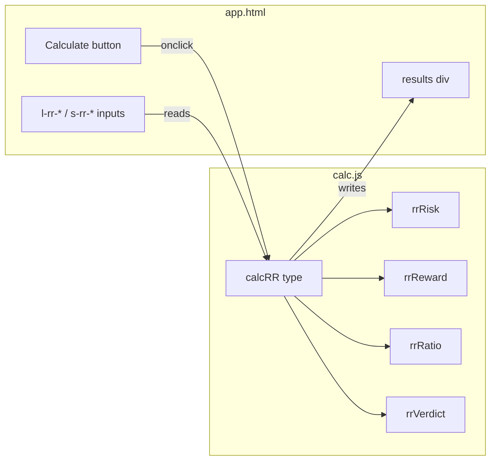

# Design Document — Risk/Reward Calculator

## Overview

Add a Risk/Reward Ratio Calculator card to both the Long and Short panels of the existing browser-based trading calculator (`app.html` + `calc.js`). The card follows the identical structure of every other tool in the app: a `.card` div with a header, input fields, a Calculate button, and a results section that appears after calculation.

The feature introduces four pure helper functions (`rrRisk`, `rrReward`, `rrRatio`, `rrVerdict`), one DOM-driving function (`calcRR`), two `HELP_CONTENT` entries, and corresponding unit tests in `tests.js`.

No new files are created. All changes land in `app.html`, `calc.js`, and `tests.js`.

---

## Architecture

The app has no build step and no module system. All logic lives in a single `calc.js` script that is appended to the DOM by `auth.js` after authentication. The design follows the same pattern as every existing calculator tool:

```
app.html  ──►  card markup (inputs + results skeleton)
calc.js   ──►  pure helpers + calcRR(type) DOM driver
tests.js  ──►  mirrored pure helpers + suite/test calls
```

The four pure helpers are completely independent of the DOM and can be tested in Node without any browser globals. `calcRR` reads from the DOM, calls the helpers, and writes results back — exactly like `calcStop`, `calcPnl`, etc.



---

## Components and Interfaces

### Pure Helpers (calc.js)

```js
/**
 * Dollar risk: absolute price distance from entry to stop,
 * scaled by leveraged position size.
 * @param {number} entryPrice
 * @param {number} stopPrice
 * @param {number} positionSize  - collateral in USD
 * @param {number} leverage
 * @returns {number}
 */
function rrRisk(entryPrice, stopPrice, positionSize, leverage)

/**
 * Dollar reward: absolute price distance from entry to take-profit,
 * scaled by leveraged position size.
 * @param {number} entryPrice
 * @param {number} takeProfitPrice
 * @param {number} positionSize
 * @param {number} leverage
 * @returns {number}
 */
function rrReward(entryPrice, takeProfitPrice, positionSize, leverage)

/**
 * Risk/reward ratio as a plain number (reward ÷ risk).
 * Returns null when risk is zero to signal a divide-by-zero condition.
 * @param {number} reward
 * @param {number} risk
 * @returns {number|null}
 */
function rrRatio(reward, risk)

/**
 * Plain-language verdict for a given ratio value.
 * @param {number} ratio
 * @returns {string}  one of: "Poor — risk outweighs reward" | "Acceptable" | "Good" | "Excellent"
 */
function rrVerdict(ratio)
```

### DOM Driver (calc.js)

```js
/**
 * Reads inputs, validates direction, calls pure helpers, writes results.
 * Follows the same signature as calcStop, calcPnl, etc.
 * @param {'long'|'short'} type
 */
function calcRR(type)
```

### HELP_CONTENT entries (calc.js)

Two new keys added to the existing `HELP_CONTENT` object:

```js
'rr-long':  { title: 'Risk/Reward Calculator — Long',  body: '…' }
'rr-short': { title: 'Risk/Reward Calculator — Short', body: '…' }
```

### HTML Cards (app.html)

One card added to `#panel-long`, one to `#panel-short`. Field IDs:

| Field | Long ID | Short ID |
|---|---|---|
| Entry price | `l-rr-entry` | `s-rr-entry` |
| Take-profit price | `l-rr-tp` | `s-rr-tp` |
| Stop-loss price | `l-rr-sl` | `s-rr-sl` |
| Leverage | `l-rr-leverage` | `s-rr-leverage` |
| Position size | `l-rr-pos` | `s-rr-pos` |
| Actual position (readonly) | `l-rr-actual` | `s-rr-actual` |
| Results container | `l-rr-results` | `s-rr-results` |
| Risk output | `l-rr-risk` | `s-rr-risk` |
| Reward output | `l-rr-reward` | `s-rr-reward` |
| Ratio output | `l-rr-ratio` | `s-rr-ratio` |
| Verdict output | `l-rr-verdict` | `s-rr-verdict` |

---

## Data Models

There are no persistent data structures. All state is ephemeral — read from DOM inputs, computed, and written back to DOM outputs within a single `calcRR` call.

### Calculation Inputs

| Name | Type | Constraints |
|---|---|---|
| entryPrice | number | > 0 |
| takeProfitPrice | number | > 0; > entryPrice (long) or < entryPrice (short) |
| stopLossPrice | number | > 0; < entryPrice (long) or > entryPrice (short) |
| positionSize | number | > 0; defaults to 4000 |
| leverage | number | ≥ 1; defaults to 10 |

### Calculation Outputs

| Name | Formula | Format |
|---|---|---|
| risk (USD) | `(|entry − stop| / entry) × pos × leverage` | `fmt()` |
| reward (USD) | `(|entry − tp| / entry) × pos × leverage` | `fmt()` |
| ratio | `reward / risk` | `"1 : N"` where N is `toFixed(2)` |
| verdict | threshold lookup on ratio | plain string |

### Verdict Thresholds

| Condition | Verdict | CSS class |
|---|---|---|
| ratio < 1.0 | "Poor — risk outweighs reward" | `metric--loss` |
| 1.0 ≤ ratio < 1.5 | "Acceptable" | `metric--neutral` |
| 1.5 ≤ ratio < 2.0 | "Good" | `metric--profit` |
| ratio ≥ 2.0 | "Excellent" | `metric--profit` |

---
